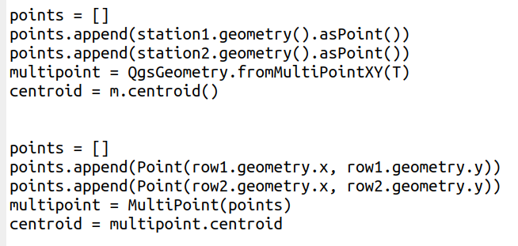

Introduction
=============

Présentation générale
----------------------

QGis a été développé à partir des librairies de l’OGR: GDAL/GEOS. La plupart de ces librairies sont développées en C++ et existent en version python par un système de binding, c’est-à-dire des fonctions qui font indirectement référence aux fonctions écrites C++. Ces librairies sont aussi utilisées par d’autres outils libres de SIG: PostGIS, GRASS, GeoServer, gvSIG, etc. Elles se décomposent en 4  principales librairies complémentaires:

* GEOS: Geometry Engine Open Source (transformations géométriques des données en format vectoriel)
* GDAL: ensemble des fonctions consacré à la gestion et à la manipulation des rasters
* OGR: ensemble des fonctions de gestion des formats et des données sous le format vectoriel
* PROJ4: ensemble des fonctions liées aux transformations des systèmes de référencement géographiques

.. .. figure:: img/OverviewLibrairiePythonSIG.png
..    :width: 500px
..    :align: center
.. 
..    Figure : Imbrication des principales librairies géospatiales

L’utilisation des fonctionnalités intégrées à QGis sont donc très proches de celles de « GDAL,OGR » et les noms de fonctions sont les mêmes noms que les fonctions C++. Attention au décalage des développements, il se peut que quelques traitements ne soient pas encore intégrés dans QGis alors qu’ils le sont dans les librairies socles.

On peut développer des scripts directement avec les librairies python de l’OGR/GDAL. Dans ce cas, pour avoir des fonctionnalités avancées, il faut faire appel à d’autres librairies ou développer ses propres traitements. On peut aussi utiliser les fonctionnalités de l’environnement QGis. On accède alors aux fonctions de « GDAL, OGR », à des fonctions de visualisation, d’interaction et de géotraitement. Mais ces environnements sont dissociés, les objets doivent restés manipulés par la librairie qui les proposent.

 
    Figure : 2 librairies pour calculer un centroïde

**Parmi ces deux blocs de code, lequel vous parait le plus facile à lire ?**
