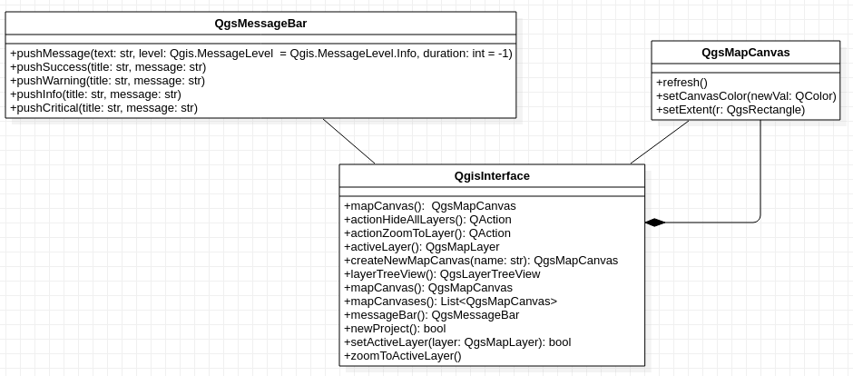

Première classe: Interface QGIS
================================

Pour interagir avec l’application QGIS, il y a l'objet **iface** qui contient l'interface graphique principale de QGis. C'est à travers cet objet qu’on peut 
faire des manipulations : accéder au canevas de la carte, aux menus, aux barres d’outils et autres composantes de l’application QGIS. On accède à cet objet, 
que l'on soit dans la console de l'application QGis ou dans une extension (*i.e.* plugIn) de QGis.

   Figure 1: Classe QgisInterface
   

La structure de l'objet *iface* est une classe de type *QgsInterface*. Cette classe est représentée dans la figure ci-dessus. On peut donc voir qu'une application QGis (représenté par *iface*) peut avoir plusieurs canvas.

**Question: Combien y'a-t-il de canvas ouvert dans votre application ?**

*Solution:*

.. code-block:: python

    listCanvas = iface.mapCanvases()
    print (len(listCanvas))

  
**Question: Ajouter un nouveau canvas et modifier la couleur de fond.**

Pour construire une couleur avec un code RGB:  
    
.. code-block:: python
	    
    QColor.fromRgb(209,242,235)

*Solution:*

.. code-block:: python

    canvasOverview = iface.createNewMapCanvas("Overview")
    canvasOverview.setCanvasColor(QColor.fromRgb(209,242,235)) 

|

