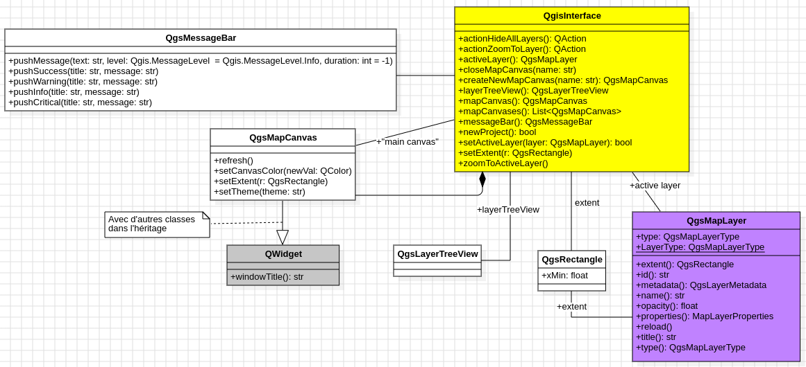

Première classe: Application QGIS
==================================

L'application QGIS est avant tout un logiciel. Son interface graphique est composée d'une zone de dessin, d'un menu et d'une barre de menu, d'une zone d'information (en mode caché quand il n'y a pas de message), de panneaux, etc. On appelle *canevas* de l'interface graphique de QGIS, la zone de dessin de QGIS, on l'appelle aussi la vue cartographique. Par défaut la vue cartographique est en 2D.

En mode programmation, pour interagir avec l’application QGIS, plus familièrement avec son interface graphique (au sens *application*), un objet va souvent nous être mis à disposition. Cet objet instanciera toutes les propriétés de l'interface graphique principale de QGIS, et le nom de la variable qui pointe vers ces informations contiendra le mot **iface**. C'est à travers cet objet qu’on pourra faire des manipulations de l'interface graphique: accéder au canevas de la carte pour récupérer les coordonnées de la souris, dessiner, accéder au menu pour ajouter une nouvelle action via un bouton, aux panneaux d’outils, créer des interractions avec l'utilisateur et autres composants de l’application QGIS. 

Cet objet est à disposition, que l'on soit:

* dans la console de l'application QGis, avec la variable *iface*
* ou dans une extension (*i.e.* plugIn) de QGis. Dans ce cas, l'objet est accessible via un attribut *self.iface*

La classe *QGisInterface*
**************************

La structure de l'objet *iface* implémente la classe *QgisInterface*. Cette classe est représentée dans la figure ci-dessous.

   Figure 1: Classe QgisInterface
   

On peut donc lire avec ce diagramme de classes qu'une application QGis (autrement dit un objet de type *QGisInterface* ou encore un objet qui implémente la classe *QGisInterface*) peut avoir plusieurs canevas puisqu'il existe une association d'aggrégation entre la classe *QGisInterface* et la classe *QgsMapCanvas*. 

Exercices
**********

**Question 2.1: Combien y'a-t-il de canevas ouvert dans votre application ?**

**Question 2.2: Ajouter un nouveau canevas et modifier la couleur de fond.**

Pour construire une couleur avec un code RGB:  
    
.. code-block:: python
	    
    QColor.fromRgb(209,242,235)

Que remarquez-vous si vous relancer plusieurs fois votre code ?

**Question 2.3: Ajouter un message dans la barre d'information de QGIS qui annonce que le nouveau canevas a bien été créé avec son titre**

Solutions
**********

*Solution de la question 2.1:*

.. code-block:: python

     listCanvas = iface.mapCanvases()
     print (len(listCanvas))

*Solution de la question 2.2:*

.. code-block:: python

     canvasOverview = iface.createNewMapCanvas("Overview")
     canvasOverview.setCanvasColor(QColor.fromRgb(209,242,235)) 

*Solution de la question 2.3:*

.. code-block:: python

     titreMessage = 'Question 2.3'
     message = 'La nouvelle vue cartographique "' + dessinMonde.windowTitle() + '" est bien créée.'
     iface.messageBar().pushInfo(titreMessage, message)

Et encore
***********

Toujours à partir de l'objet *iface*, on peut récupérer le layer "courant", c'est à dire celui qui a été sélectionné par l'utilisation de l'application et qui est en surbrillance:

.. code-block:: python
   
     layer = iface.activeLayer()

Pour zoomer sur une emprise d'une couche de donnée. On commence par récupérer l'emprise de la couche de donnée, qui est de type *QgsRectangle* et on l'affecte au canevas de QGIS avec la méthode *setExtent*. Enfin, on rafraîchit la zone de dessin pour recalculer le dessin.

.. code-block:: python

     iface.mapCanvas().setExtent(layer.extent())
     iface.mapCanvas().refresh()
