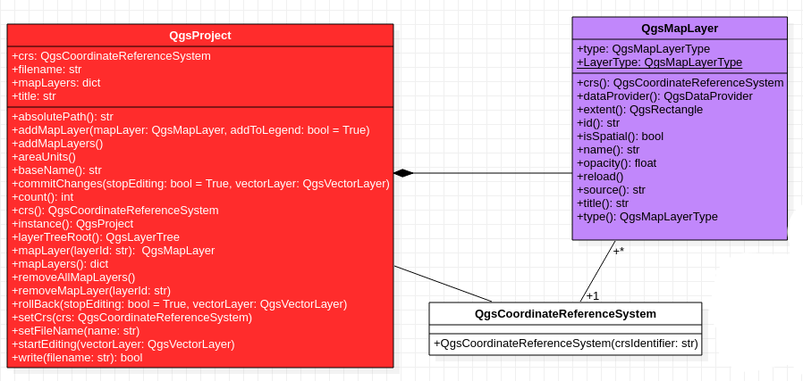

2. Le projet QGIS
==================

Un projet QGIS permet de gérer un ensemble de couches avec leurs propriétés (sémiologie par exemple), la projection de la carte, une échelle, etc. On peut l'enregistrer et l'ouvrir à une prochaine occasion. Il permet de sauvegarder un espace de travail d'un travail et son contexte.

L'application QGIS ne gère qu'un seul et unique projet à la fois: deux projets ne peuvent pas être ouverts en même temps dans la même application, et un projet est toujours ouvert si l'application QGIS est lancée. Il peut-être vide et stocké soit en mémoire soit être enregistré. 

   Figure 2: Classe QgsProject

Le diagramme de classes de la figure ci-dessus représente une partie des classes qui interagissent avec un projet QGIS et les méthodes de la classe *QgsProject* qui permettent de récupérer des informations ou de modifier ses caractéristiques, comme par exemple la liste des layers et de leur symbologie. 

Par son caractère unique, l'implémentation du concept projet suit la modélisation du design pattern Singleton. Cela veut dire que pour interagir avec le projet QGis (comme accéder aux propriétés ou aux traitements) on accède à l'instance courante directement à partir de la classe *QgsProject*. La méthode *instance* permet de récupérer l'instance du projet ouvert dans QGis:

.. code-block:: python

     monProjet = QgsProject.instance()

Les couches de données du projet
*********************************

Les layers sont stockés dans un attribut de la classe *QgsProject* de type dictionnaire, dont les clés sont les identifiants internes de QGIS des couches de données. On peut très vite récupérer la liste de tous les layers du projet ouvert:

.. code-block:: python
   
     # Liste des layers dans un dictionnaire
     layers = monProjet.mapLayers()
     print ("Nb de layers du projet = "  + str(len(layers)))

     # On extrait les valeurs du dictionnaire pour obtenir les objets de type QgsMapLayer
     listLayers = layers.values()

     # Par exemple, on peut afficher le premier nom du layer du dictionnaire:
     listLayers[0].name()

On a deux méthodes pour récupérer un layer:

.. code-block:: python

     # Méthode 1 : boucle sur les layers
     for layer in listLayers:
         print ("Nom du layer = ", layer.name())
      
     # Méthode 2 : en récupérant le layer par son nom
     QgsProject.instance().mapLayersByName('srtm')[0]

Pour récupérer un layer dans une variable suivant son nom:

.. code-block:: python
   
     layerPays = None
     for ilayer in QgsProject.instance().mapLayers().values():
          if ilayer.name() == "Pays":
              layerPays = ilayer
              break
     print (layerPays.name())

Système de coordonnées de référence du projet
***********************************************

**Question 3.1: Ajouter la projection au layer POI_BDTOPO**

Sauvegarde du projet
**********************

La méthode *write()* de la classe *QgsProject* permet d'enregistrer le projet dans un fichier.

.. code-block:: python
   
     QgsProject.instance().write('/home/projet/mon_project.qgs')
