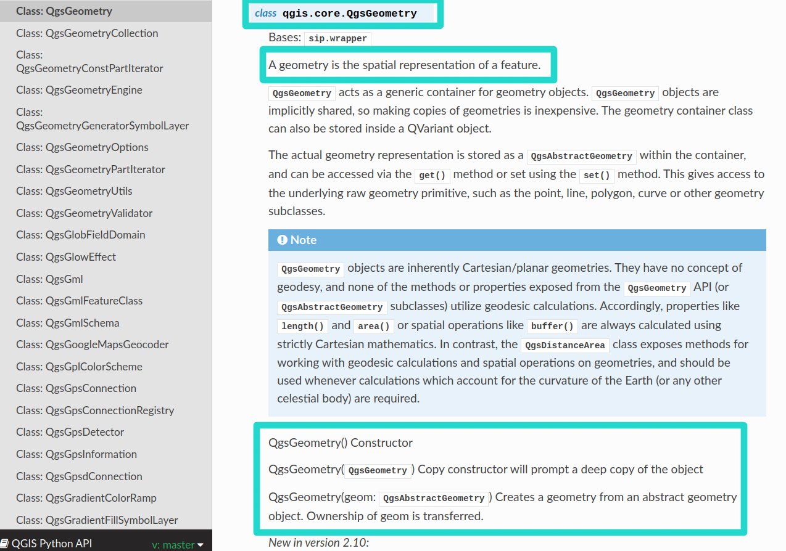
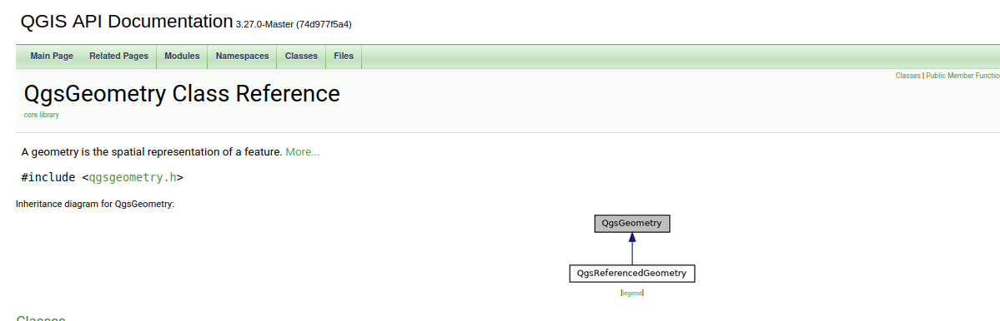

3. Documentation de l'API QGIS
===============================

Structure de la documentation
******************************

L'API QGIS est programmée en orienté objet. Sa documentation (un extrait est proposé dans la figure \ref{docpythonqgis}), créée automatiquement, est très dense et pas encore parfaite (un peu dû au langage python). Par exemple, on ne lit pas les attributs des classes dans la documentation.

   Figure 3: Documentation de l'API QGis écrite en python (\url{https://qgis.org/pyqgis/master/})

La documentation de l'API QGIS écrite en C++ est plus détaillée concernant l'orienté objet (extrait proposé dans la figure ci-dessous.

   Figure 4: Documentation de l'API QGis écrite en C++ (\url{https://api.qgis.org/})

		
**Question 3.1: Dans la documentation de l'API QGis, \url{https://qgis.org/pyqgis/master/}, trouver la documentation de la classe \textit{QgsProject}, puis identifier la méthode qui permet de supprimer tous les layers du projet QGIS courant.**

Constructeur des classes
*************************

La définition des constructeurs d'une classe sont décrits sous forme de texte dans l'entête de la documentation. 

**Question 3.2: Toujours à partir de la documentation de l'API QGis, cherchez comment construire un rectangle de coordonnées: (933103.3, 6396709.3) et (977596.5, 6443886.2).Puis ajouter l'instruction qui fait que l'emprise du canevas corresponde à ce rectangle.**

Méthodes Get et Set dans API QGIS
**********************************

Les méthodes \textit{getXXX} et \textit{setXXX} permettent de deviner les attributs d'une classe. L'API QGIS propose très souvent ces deux méthodes. Attention, les développeurs n'ont pas utilisés le mot *get* dans le nom des méthodes getteurs. Par exemple, dans la classe *QgsRectangle*, on a: *xMaximum()* et *setXMaximum(x)*, etc.

Méthodes statiques
*******************

**Question 3.3: Toujours avec la classe *QgsRectangle*, analysez les deux méthodes: *fromCenterAndSize* et *fromWkt*. Que font-elles ? Comment peut-on les utiliser ?**

Solutions
**********

**Solution de la question 3.1:**

.. code-block:: python

     # On nettoie: on supprime tous les layers du projet
     QgsProject.instance().removeAllMapLayers()

**Solution de la question 3.2:**

.. code-block:: python

     # Première solution
     rect1 = QgsRectangle(933103.3, 6396709.3, 977596.5, 6443886.2)

     # Deuxième solution
     rect2 = QgsRectangle(QgsPointXY(933103.3, 6396709.3), QgsPointXY(977596.5, 6443886.2))

     # On prend un des deux rectangles, ce sont les "mêmes" et on modifie l'emprise du canevas
     iface.mapCanvas().setExtent(rect2)

