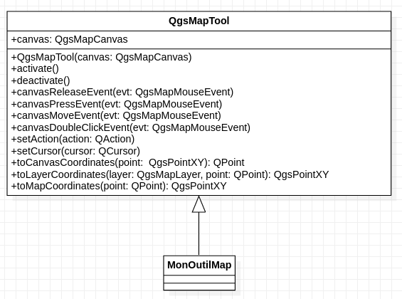

Test !
=======

An example of Kernel simplification with an 
`Gaussian Filter <https://tracklib.readthedocs.io/en/latest/api/core/core-kernel.html#tracklib.core.Kernel.GaussianKernel>`__:
 
    
.. code-block:: python

  kernel = GaussianKernel(3)
  trace.operate(Operator.FILTER, "x", kernel, "x_filtered")
  trace.operate(Operator.FILTER, "y", kernel, "y_filtered")
  trace.plot(append = False, sym='g-', label='original track')
  plt.plot(trace.getAnalyticalFeature("x_filtered"), trace.getAnalyticalFeature("y_filtered"), 
		 'b-', label='simplify:gaussian filter')
  plt.legend()
  

   Figure 1: Simplification with a gaussian kernel filter

